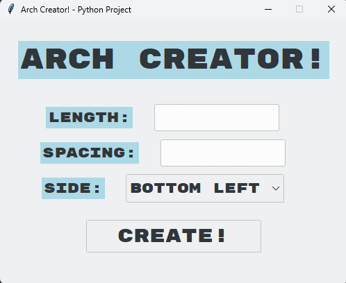
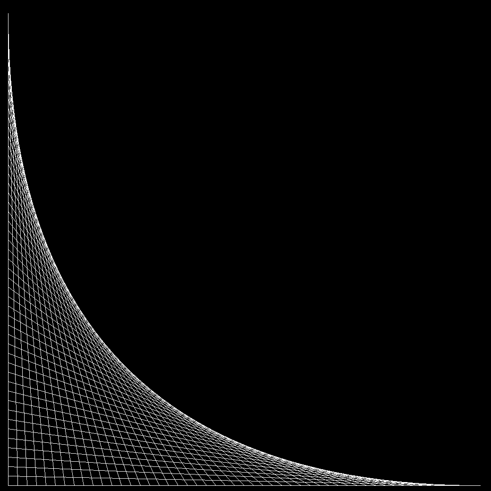

# 🏛️ Arch Creator




 
## Features
- Enter custom length and spacing values to generate a unique arch pattern
- Choose the corner of the arch: bottom left, bottom right, top left, or top right
- Choose a theme for the canvas: Auto (follows system), Dark, or Light
- Renders the arch using a fullscreen turtle canvas
- Input validation — only numbers accepted, empty fields and zero values are caught
- Re-create arches without restarting the program (keep the turtle window open and switch back to the control panel)
- Themed UI using the Breeze theme via ttkthemes
- Animated status label for completion, errors, and invalid input
- Both windows close together when either is closed

## Technologies Used
- Python 3
- `turtle` — arch rendering
- `tkinter` / `ttk` — control panel UI
- `ttkthemes` — Breeze theme
- `darkdetect` — system theme detection
- `numpy` — arch coordinate calculations

## How to Run
1. Make sure both `arch_creator.py` and `arch_library.py` are in the same folder
2. Install dependencies:
```bash
pip install numpy ttkthemes darkdetect
```
3. Run `arch_creator.py`

## Required Files
- `arch_creator.py` — main program
- `arch_library.py` — arch drawing library

## Notes
- To create a new arch, **do not close the turtle window** — simply bring the control panel back to the front and click Create again
- Running `arch_library.py` directly will show an error message by design
- Length and spacing values cannot be 0

## Author
**AlexIsNotInset**
